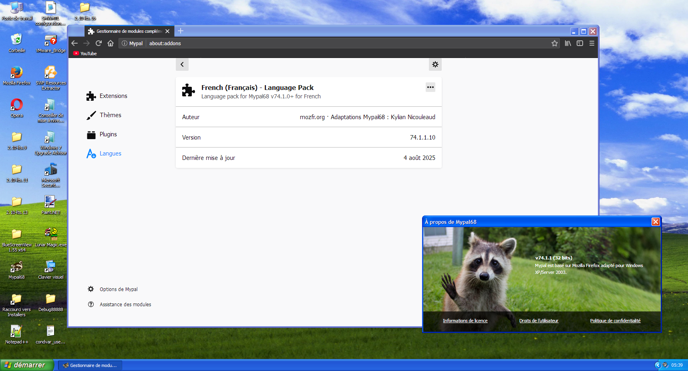

# Mypal68 French Language Pack
### Pack de langue française pour Mypal68

This repo contains files for the French language package for the , based on Firefox 68.

## Requirements for installing and using this language pack
- Mypal68 [v68.13.1b](https://github.com/Feodor2/Mypal68/releases/tag/68.13.1b) or [later](https://github.com/Feodor2/Mypal68/releases/latest)
- Speaking (or knowing) French
- Loving baguettes (I'm kidding)

## Downloading the Language Pack
You can download the language pack on the [Releases](../../releases) page.

### Specific releases per version of Mypal68:
As a clean is performed each major version published (68.13; 68.14; and so on), it is recommended to use a version of the language pack that is specifically made for the branch you use, or you can end with a partially untranslated UI due to old strings that got removed in newer revisions of the Language Pack.

Here you can find a table with the most recommended version to use for each version of Mypal68:

| Version                                                                                                                                                 | Recommanded LP release                                                  |
|---------------------------------------------------------------------------------------------------------------------------------------------------------|-------------------------------------------------------------------------|
| [v68.13.0b]()                                                                                                                                           | **Unsupported**                                                         |
| [v68.13.1b](https://github.com/Feodor2/Mypal68/releases/tag/68.13.1b) up to [v68.13.9b](https://codeberg.org/Theodor2/Mypal68/releases/tag/68.13.9b)    | [v68.13.1.30](../../releases/tag/v68.13.1.30) (Released April 23, 2024) |
| [v68.14.0b](https://codeberg.org/Theodor2/Mypal68/releases/tag/68.14.0b) and [later](https://codeberg.org/Theodor2/Mypal68/releases)                    | [v68.14.1.00](../../releases/tag/v68.14.1.00) (Released April 24, 2024) |
